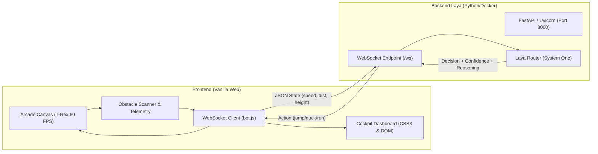
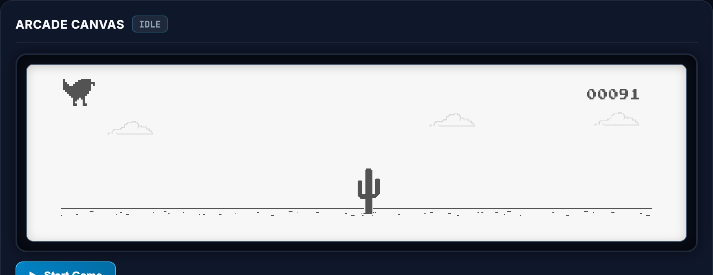
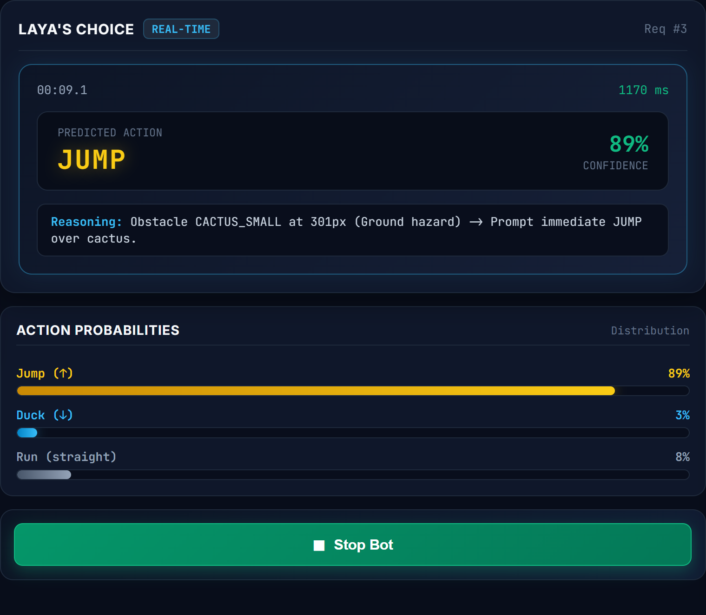
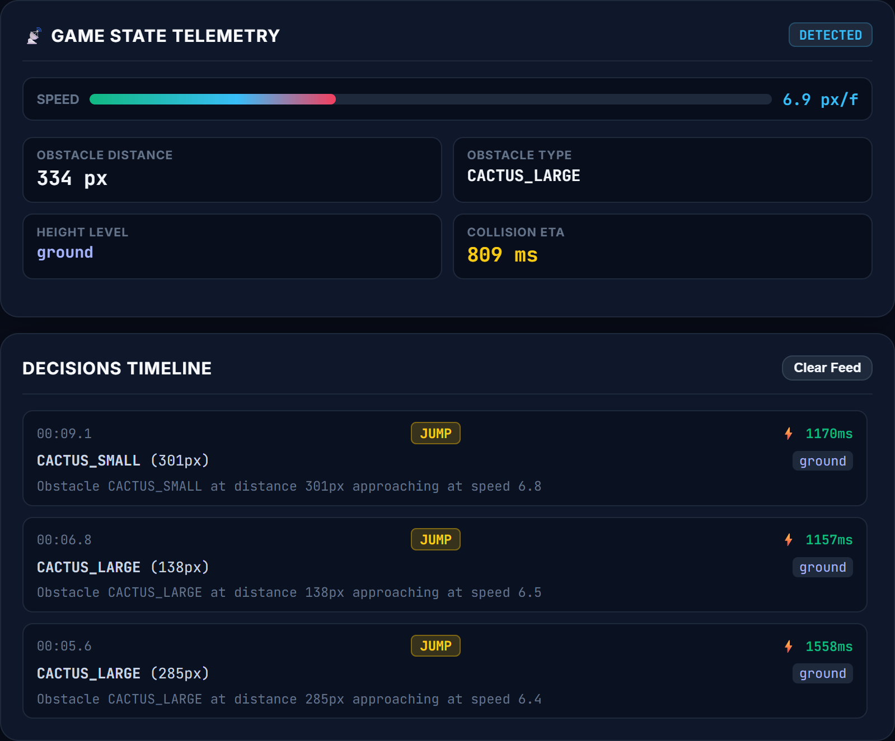

# laya-rex

> Real-time telemetry dashboard and autonomous control center for **T-Rex Runner**, powered by the **Laya System One** decision engine. Built with **100% Vanilla HTML5, CSS3, and JavaScript** (zero frameworks), inspired by modern AI tactical agent cockpits.


---

## 📌 Table of Contents
- [Overview](#-overview)
- [System Architecture](#-system-architecture)
- [How It Works](#-how-it-works)
  - [1. Perception & Action Loop (Pipeline)](#1-perception--action-loop-pipeline)
  - [2. Low-Latency WebSocket Communication](#2-low-latency-websocket-communication)
- [Cockpit Dashboard Overview](#-cockpit-dashboard-overview)
- [Project Structure](#-project-structure)
- [Getting Started](#-getting-started)
  - [Option A: Using Docker (Recommended)](#option-a-using-docker-recommended)
  - [Option B: Native Python Environment](#option-b-native-python-environment)
  - [Running the Frontend](#running-the-frontend)
- [Controls & Hotkeys](#-controls--hotkeys)
- [License](#-license)

---

## 🚀 Overview

**laya-rex** integrates the classic Chromium offline dinosaur runner with the **Laya Router** (System One). Rather than relying on simple static collision rules, the game extracts the dynamic geometric state of oncoming obstacles on every frame and transmits these variables over **WebSocket** to the inference backend.

The server evaluates the obstacle's coordinates, type, and speed using the Laya model, returning probabilistic decisions along with confidence scores to **Jump (`jump`)**, **Duck (`duck`)**, or **Run (`run`)**.

---

## 🏗 System Architecture



---

## 🧠 How It Works

### 1. Perception & Action Loop (Pipeline)

On each frame (`requestAnimationFrame`), the client executes the following lifecycle, reflected in the horizontal pipeline ribbon:

```
[1. Frame Scan] ➔ [2. Obstacle Detection] ➔ [3. State JSON] ➔ [4. Laya Inference] ➔ [5. Action Trigger]
```

1. **Frame Scan (60 FPS)**: Monitors the dinosaur's collision boxes and the active horizon line.
2. **Obstacle Detection**: Detects incoming cacti (`CACTUS_SMALL`, `CACTUS_LARGE`) or pterodactyls (`PTERODACTYL`).
3. **State JSON**: When an obstacle enters the dynamic decision window (scaled proportionally to current game speed), a compact JSON state vector is generated.
4. **Laya Inference**: The server processes the vector using CPU-optimized multithreaded PyTorch and streams back the decision over the open WebSocket.
5. **Action Trigger**: The autonomous reflex executes a jump or duck on the canvas while live telemetry charts and distribution bars update in the dashboard.

---

### 2. Low-Latency WebSocket Communication

Unlike traditional HTTP REST calls, the connection remains persistently open via bidirectional WebSocket, eliminating repeated TCP and TLS handshake overhead:

#### Outgoing Payload (Frontend ➔ Server):
```json
{
  "obstacle_distance": 285.4,
  "obstacle_type": "CACTUS_LARGE",
  "obstacle_y": 100.0,
  "speed": 6.8
}
```

#### Incoming Payload (Server ➔ Frontend):
```json
{
  "action": "jump",
  "confidence": 0.86,
  "model_received": {
    "obstacle": "CACTUS_LARGE",
    "distance_pixels": 285.4,
    "height_level": "ground",
    "game_speed": 6.8,
    "summary": "Obstacle CACTUS_LARGE at distance 285px approaching at speed 6.8"
  }
}
```

---

## 🎛 Cockpit Dashboard Overview

The dashboard is structured into 3 tactical columns:

| Section | Description | Preview |
| :--- | :--- | :---: |
| **Column 1: Arcade Canvas** | Dark bezel monitor frame housing the original T-Rex game with sprites and audio preserved, plus a quick `Start / Restart Game` control. |  |
| **Column 2: Laya Decision Engine** | **Laya's Choice:** Prominent badge displaying the active prediction (`JUMP`, `DUCK`, `RUN`), confidence percentage, and synthetic reasoning text.<br>**Action Probabilities:** Animated horizontal bars showing distribution across Jump, Duck, and Run.<br>**Bot Switch:** Big toggle button to pause or resume autonomous mode. |  |
| **Column 3: Telemetry & Timeline** | **Game State Telemetry:** Real-time speed gauge (`px/f`), obstacle distance, height level (`ground`, `flying_mid`, `flying_high`), and estimated collision ETA with threat badges (`SAFE`, `DETECTED`, `APPROACHING`, `CRITICAL`).<br>**Decisions Timeline:** Real-time vertical feed logging recent decisions with micro-latencies and contextual summaries. |  |

---

## 📂 Project Structure

```plaintext
t-rex-runner/
├── laya/                           # AI Inference Backend
│   ├── dockerfile                  # Docker container with Python 3.11, PyTorch, and Laya
│   └── laya_bot_server.py          # FastAPI server with WebSocket endpoint and Laya Router
│
├── t-rex/                          # Web Frontend
│   ├── assets/                     # Original game spritesheets (100% and 200%)
│   ├── bot.js                      # WebSocket connection, telemetry, FPS counter, auto-play logic
│   ├── index.css                   # Default T-Rex styles
│   ├── index.html                  # 3-column cockpit interface and game canvas
│   └── index.js                    # T-Rex physics, collision detection, and horizon mechanics
│
├── uploads/                        # AI generated images
│   ├── laya_cockpit_5k.png         # Full Dashboard Banner
│   ├── laya_arcade_canvas_5k.png   # Arcade Canvas Preview
│   ├── laya_decision_engine_5k.png # Decision Engine & Probabilities Preview
│   └── laya_telemetry_5k.png       # Telemetry & Decisions Timeline Preview 
└── README.md                       # Project documentation
```

---

## 🛠 Getting Started

### Prerequisites
- [Git](https://git-scm.com/)
- [Docker](https://www.docker.com/) (or Python 3.11+ installed locally)

---

### Option A: Using Docker (Recommended)

1. **Build and run the Laya inference container:**
   ```bash
   cd laya
   docker build -t laya-server .
   docker run -d --name laya-server -p 8000:8000 laya-server
   ```

2. **Verify health endpoint:**
   Open in your browser or run: `curl http://localhost:8000/ok` (should return `{"status":"ok"}`).

---

### Option B: Native Python Environment

1. **Install dependencies:**
   ```bash
   pip install laya fastapi uvicorn websockets torch
   ```

2. **Start the server:**
   ```bash
   cd laya
   python laya_bot_server.py
   ```

---

### Running the Frontend

Serve the `t-rex/` directory with any static file server:

1. **Using Python's built-in HTTP server:**
   ```bash
   cd t-rex
   python -m http.server 8080
   ```

2. **Open in your browser:**
   Navigate to: **[http://localhost:8080/index.html](http://localhost:8080/index.html)**

The game connects automatically to `ws://127.0.0.1:8000/ws` and begins autonomous navigation.

---

## 🎮 Controls & Hotkeys

- **Mode Switching:**
  - Click **Live Auto-Play** or **Manual Control** in the header.
  - Or toggle the **Stop Bot / Start Bot** button in the center column.
- **Keyboard Controls:**
  - <kbd>Space</kbd> or <kbd>↑</kbd>: Jump (also starts/restarts the game).
  - <kbd>↓</kbd>: Duck (evade mid-air pterodactyls).
  - <kbd>Alt</kbd>: Pause / Unpause the game.

---

## 📄 License

Original T-Rex Runner code is copyright Chromium / Google Inc. Dashboard UI adaptations and Laya System One decision engine integration are licensed under the MIT License.
